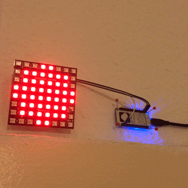
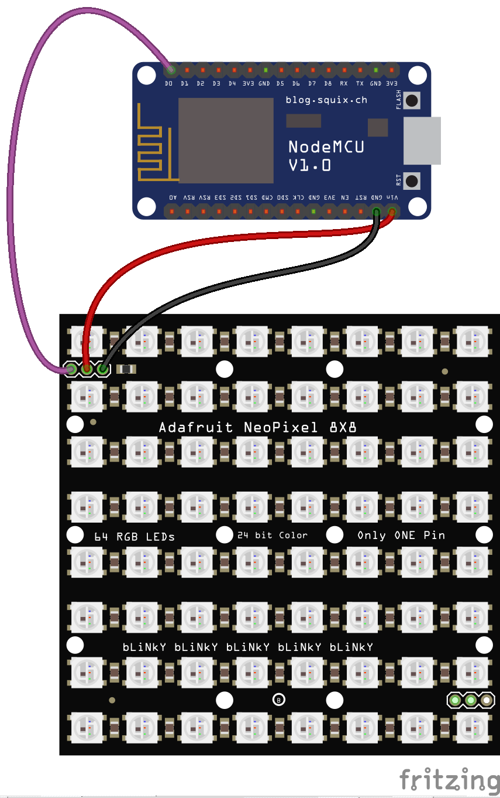

<p align="center">
  <font size="7">🚨</font>
  <h1 align="center">Twich Live Lamp</h1>
</p>
<p align="center">A hardware hack that turns on an LED matrix based on whether a certain user is currently streaming on Twitch or not. </p>

---

## Demo



## Requirements

### Hardware

- NodeMCU v1.0 (or any other ESP8266 development board)
- Adafruit 8x8 NeoMatrix

### Software

- [Node.js](https://nodejs.org/) v8.5 or higher
- [A Twilio account](https://www.twilio.com/) - [Sign up here](https://www.twilio.com/try-twilio)
- [Arduino IDE](https://www.arduino.cc/en/Main/Software)

## Installation

### 1. Download project & install Node.js dependencies

```bash
git clone https://github.com/dkundel/twitch-live-lamp.git
cd twitch-live-lamp
npm install
```

### 2. Copy configuration files

```bash
cp .env.example .env
cp twitch-live-lamp/Config.example.h twitch-live-lamp/Config.h
```

### 3. Change values in the configuration files

#### 3a. `.env` file

Either set these values in this file or configure them as actual environment variables.

#### 3b. `Config.h` file

These values need to be set in this file. If you are wondering how to get some of these values, [check out this blog post about Twilio Sync IoT](https://www.twilio.com/blog/2017/10/esp8266-led-real-time-twilio-sync-iot.html).

### 4. Open the `twitch-live-lamp`

Open the `twitch-live-lamp` folder in the Arduino API and make sure you choose under `Tools -> Boards` your ESP8266 board. If it is not sure make sure to install it via the board manager.

### 5. Download the necessary Arduino libraries

You'll need the following libaries. Make sure you have them installed in your Arduino IDE:

- Adafruit NeoPixel
- Adafruit GFX
- Adafruit NeoMatrix
- PubSubClient
- ArduinoJson

### 6. Flash the code onto your ESP8266

### 7. Wire up your Matrix according to the following diagram



### 8. Start the Node.js process to continously check

If you are using the `.env` file start the service by running:

```bash
npm run dev
```

If you have the values stored in your environment variables run:

```bash
npm start
```

Since this process needs to continously run, you might want to check out projects like [forever](https://npm.im/forever) or [pm2](https://npm.im/pm2)

### 9. Power up your board

We are powering ours via a power bank but you can also just plug in a normal USB charger.

## License

MIT

## Contributors

- [Dominik Kundel](https://github.com/dkundel)
- Felix Kaul


